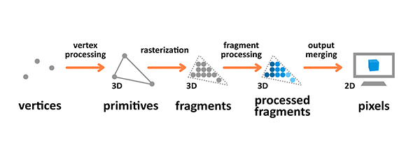

#Three.js全景转换时实现淡出淡入效果
<video  preload="none" >
<source src='./全景淡入淡出.mp4' type="video/mp4">
</video>

在进入主题前，先来讲一些前置知识，方便能理解实现过程的代码。
## webGL前置知识
webGL为一个光栅化引擎，在GPU中运行，需要使用能在GPU中运行的代码。代码需提供成对的方法，顶点着色器和片段着色器。每对代码组合成一个program（着色程序）。
其中顶点着色器用来计算顶点的位置，片段着色器用于计算出当前图元每个像素的颜色值。
## 3D渲染流程


3D渲染流程即将准备好的数据渲染输出到屏幕的过程，如上图所示。

**（1）顶点处理**
顶点处理将独立的顶点信息组合成原始数据并设置其在3D空间中的坐标，方便显示器识别。处理过程包括一下四个步骤
（1）模型转换 model transformation 。
（2）视图转换 view transformation ,这一步只关心位置和3D空间中相机的朝向。

相机的三个参数：位置、方向、朝向
（3）投射转换 projection transformation
（4）视图窗口转换 viewport transformation

**（2）栅格化**
原数据转换为片段

**（3）片段合成**
基于给定参数计算像素最终的颜色

**（4）输出合成**
3D空间的原始数据的片段，被转换2D像素网格，然后打印到屏幕像素上

<!-- 3D渲染流程会接收使用顶点描述3D物体的原始数据作为输入用于处理，并计算其片段，然后渲染为像素输出到屏幕。
①原始数据：渲染流程中的输入（用顶点生成）
②片段：一个像素的3D投射
③像素：屏幕上的2D网格中的点布置的点 -->

## GLSL着色器
着色器有两种类型：
（1）顶点着色器：用于将几何形状转换到真实的3D绘制坐标中。
（2）片段着色器：用于计算最终渲染的颜色和其他属性。

### 顶点着色器
  顶点着色器操作3D空间的坐标并且每个顶点都会调用一次这个函数。其目的是设置 gl_Position 变量。 （gl_Position 是一个特殊的全局内置变量，它是用来存储当前顶点的位置）
  顶点着色器需要的数据，可以通过以下三种方式获得：
  1、Attributes 属性 (从缓冲中获取的数据)
  2、Uniforms 全局变量 (在一次绘制中对所有顶点保持一致值)
  3、Textures 纹理 (从像素或纹理元素中获取的数据)


### 片段着色器
片段 (或者纹理) 着色器，在计算时定义了每个像素的 RGBA 颜色（注：每个像素只调用一次片段着色器）。这个着色器的作用是设置 gl_FragColor 变量，也就是一个片段着色器需要的数据，可以通过以下三种方式获得：
1、Uniforms 全局变量 (在一次绘制中对所有顶点保持一致值)
2、Textures 纹理 (从像素或纹理元素中获取的数据)
3、Varying变量

### 变量说明
**attributes和缓冲**
缓冲是发送到GPU的一些二进制数据序列，通常情况下缓冲数据包括位置，法向量，纹理坐标，顶点颜色值等。
属性用来指明怎么从缓冲中获取所需数据并将它提供给顶点着色器。
**uniforms**
uniforms变量是外部程序传递给shader的变量，不能被shader程序修改。
一般用来表示变换矩阵、材质、光照参数和颜色
**varyings**
varying是可变量，一种顶点着色器给片段着色器传值的方式。即为了使用可变量，要在两个着色器中定义同名的可变量。给顶点着色器中可变量设置的值，会作为参考值进行内插，在绘制像素时传给片断着色器的可变量。
<!-- 变量是vertex和fragment shader之间做数据传递用的。varying变量在vertex和fragment shader二者之间的声明（变量名）必须是一致的。 -->


**textures**
纹理是一个数据序列，可在着色程序运行中随意读取其中的数据。

## 全景转换的过渡效果实现
本实例中的全景通过three.js构建天空盒子的来实现的。使用了色器材质（ShaderMaterial）来实现纹理贴图。
注意：根据前面webGL前置知识中所说，每个着色程序中需要一个顶点着色器vertexShader和一个片段着色器fragmentShader。
在全局变量uniform中定义两个变量，保存当前展示的纹理图片和下一个要展示的问体力图片。在片段着色器中，为像素设置颜色时，巧用mix实现淡出淡入效果。
<!-- **顶点着色器代码**
projectionMatrix
````javascript
varying vec2 vUv;
void main() {
    vUv = uv; //传递纹理坐标到片段着色器
    //gl_Position是顶点转换到裁剪空间中的坐标值，GPU接收该值并保存起来。
    gl_Position = projectionMatrix * modelViewMatrix * vec4(position, 1.0);
}
````
**片段着色器代码**
````javascript
 //texture3、texture4是纹理
//vUv是顶点着色器传入的值
uniform sampler2D texture3;
uniform sampler2D texture4;
varying vec2 vUv;
uniform bool isoriginColor;
uniform float time;
void main() {
    vec2 position = -1.0 + 2.0 * vUv;
    vec4 color3 = texture2D(texture3, vUv); vec4 color4 = texture2D(texture4, vUv); //使用texture2D方法，在纹理上找到对应颜色
    vec3 tarcolor = color3.rgb; //获取纹理颜色
    if (isoriginColor == false) { tarcolor = mix(color3.rgb, color4.rgb, time); }  //使用mix方法实现纹理混合。这里的time取值0~1，取0表示color3透明度为1，color4透明度为0
    gl_FragColor = vec4(tarcolor, 1.0);
}, -->

````
完整函数代码如下：
````javascript
 /**
   * 根据6面体进行创建全景
   * @param imagePath 图片路径
   */
  loadCube(imagePath: string) {
    if (!THREE) {
      console.warn('lazy load three.js, must be run after createScene Promise.resolve.');
      return;
    }
    // 此处顺序不能打乱,d,l,f,u,r,b
    // Three天空盒子的图片顺序是，右、左、上、下、后、前。这里的顺序和three的不一样，但在下面做了镜像
    const imgList = [
      `${imagePath}_d.jpg`,
      `${imagePath}_l.jpg`,
      `${imagePath}_f.jpg`,
      `${imagePath}_u.jpg`,
      `${imagePath}_r.jpg`,
      `${imagePath}_b.jpg`,
    ];
    this.uniforms = [] as any; 
    Promise.all(
      imgList.map(
        (val, index) =>
          new Promise((resolve, reject) => {
            // 纹理加载
            new THREE.TextureLoader().load(
              val,
              (texture) => {
                this.uniforms[index] = {
                  time: { value: this.time },
                  texture3: { value: this.texture[index] },
                  texture4: { value: texture },
                };
                resolve(
                    // 着色器材质
                  new THREE.ShaderMaterial({
                    uniforms: this.uniforms[index],
                    vertexShader: //顶点着色器
                      'varying vec2 vUv;' +
                      'void main() {' +
                      'vUv=uv;' + //传递纹理坐标到片段着色器
                      //gl_Position是顶点转换到裁剪空间中的坐标值，GPU接收该值并保存起来。
                      'gl_Position = projectionMatrix * modelViewMatrix * vec4(position, 1.0);}',
                    fragmentShader: //片段着色器
                    //texture3、texture4是纹理
                    //vUv是顶点着色器传入的值
                      'uniform sampler2D texture3;uniform sampler2D texture4;varying vec2 vUv;' +
                      'uniform bool isoriginColor;' +
                      'uniform float time;' +
                      'void main() {' +
                      'vec2 position =-1.0+2.0*vUv;' +
                      'vec4 color3=texture2D(texture3,vUv); vec4 color4=texture2D(texture4,vUv);' + //使用texture2D方法，在纹理上找到对应颜色
                      'vec3 tarcolor=color3.rgb;' + //获取纹理颜色
                      'if(isoriginColor == false){ tarcolor = mix(color3.rgb, color4.rgb,time);}' +  //使用mix方法实现纹理混合。这里的time取值0~1，取0表示color3透明度为1，color4透明度为0
                      'gl_FragColor = vec4(tarcolor, 1.0);' +
                      '}',
                  })
                );
                this.texture[index] = texture;
              },
              () => {},
              (err) => {
                reject(err);
              }
            );
          })
      )
    )
      .then((materials: any) => {
        const geometry = new THREE.BoxGeometry(200, 200, 200); //创建方盒
        geometry.applyMatrix4(new THREE.Matrix4().makeScale(1, 1, -1)); //这里对纹理进行了旋转，为了保证我们架子的6张图片和Three.js中天空盒子方向相对应
        const mesh = new THREE.Mesh(geometry, materials); 
        this.scene?.add(mesh);
        this.time = 0.0;
        this.animate();
      })
      .catch((err) => {
        console.error(err);
        ElMessage.error('全景数据加载失败！');
      });
  }

   private animate() {
    this.time += 1 / 66; // 刷新频率一秒最多刷新60帧或者70帧。这里表示希望刷新频率在多少帧内完成
    this.update();
    const animationFrame = requestAnimationFrame(this.animate.bind(this));
    if (this.uniforms && this.uniforms.length > 0) {
      this.uniforms.forEach((element) => {
        element.time.value = this.time > 1.0 ? 1.0 : this.time;
      });
    }
    if (this.stop) {
      cancelAnimationFrame(animationFrame);
    }
  }
````
