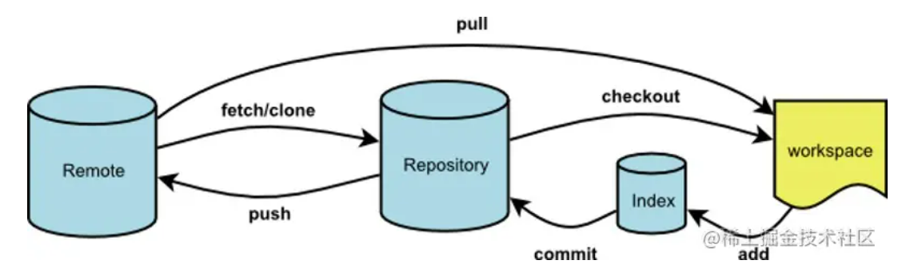

### 什么是git
git是一个C语言写的分布式版本控制系统

### Git的工作区域和流程

**（1）workspace：**工作区，进行开发改动的地区，即开发人员看到的最新的内容，开发时是对工作区的内容进行改动

**（2）Index：**暂存区，当执行git add 的命令时，工作区的文件就会被移入暂存区，暂存区标记了当前工作中哪些内容是被git管理的，当完成某个需求或者功能后需要提交代码，第一步就是通过git add 先提交到暂存区

**（3）repository：**本地仓库，位于自己的电脑上，通过git commit提交暂存区的内容才会进入本地仓库

**（4）remote：**远程仓库，用来托管代码的服务器，远程仓库的内容能够被分布在多个地方的处于写作关系的本地仓库修改，本地仓库修改完代码后通过git push命令同步到远程仓库

### git基本操作
（1）git add 添加文件到缓存区1
①git add .  添加所有的文件到暂存区
②git add filename 添加某个文件到缓存区
（2）git commit 

....未完

### 多人合作提交git

大致流程：首先，暂存自己的代码，拉取自己的远程分支，合并冲突。将现在的代码推到自己的分支上，切换到dev分支，拉取远程的dev分支合并冲突。本地dev分支拉取自己的远程分支，合并冲突，将本地的dev合并到远程的dev上

### 删除本地分支

    git branch -dlocal_branch_name

### 本地分支和远程分支关联

git branch --set-upstream-to=origin/name

### 查看本地关联的分支

Git branch -vv

### 如何在VScode上配置git bash