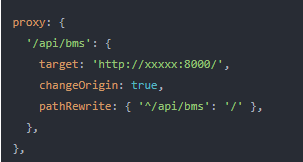

## HTTP
HTTP是一种无状态协议，每个HTTP请求之间是相互独立的，没有内建的机制来维护两个事务之间的状态。（例如：当一个用户在请求一个页面后在去请求另一个页面时，HTTP请求将无法告诉我们这两个请求是否来自同一个用户）
会话控制技术：在网站中常需要通过对变量的跟踪，使多个请求事物之间建立联系，再根据授权和用户身份显示不同的内容、不同页面。
常用会话控制技术：
（1）Cookie：通过客户端中记录信息而确定用户身份
（2）Session：通过再服务器端记录信息而确定用户身份

## Cookie工作原理：
cookie是一个服务器留在用户计算机上的很小的文本文件，包含在HTTP请求报文中web服务器和浏览器之间传递。每当同一台计算机通过浏览器请求页面时，这台计算机将会发送cookie。通过PHP可以创建并取回cookie
①服务器通过在HTTP响应报文中设置一个SetCookie字段，并把cookie数据放在该字段中随着HTTP报文传给浏览器
②浏览器在接收到HTTP响应报文后，检查到Set-Cookie字段值，会在本地创建一个Cookie文件来保存数据
③当浏览器再次向该服务器发送请求时，浏览器会先搜索本地保存的Cookie文件，如果在cookie文件中有任何与正在连接的URL相关的cookie，就在HTTP请求报文中设置一个Cookie字段，并把cookie文件中的数据添加到该字段中，最后把携带Cookie字段的HTTP请求报文发送给服务器

第一次访问网站的时候，浏览器发出请求，服务器响应请求后，会将cookie放入到响应请求中，在浏览器第二次发请求的时候，会把cookie带过去，服务端会辨别用户身份，当然服务器也可以修改cookie内容。

## session工作原理
session是在服务器端保持用户会话数据的一种方法。session对象存储特定用户会话所需的属性及配置信息
当浏览器第一次访问 PHP 脚本时，seesion_start() 函数会创建一个唯一的 Session ID（每个客户端都有一个唯一的标识），并自动通过 HTTP 的响应头，将这个 Session ID 保存到客户端 Cookie 中。同时，也在服务器端创建一个以 Session ID 命名的文件，用于保存这个用户的会话信息；
当同一个用户再次访问这个网站时，会自动通过 HTTP 的请求头将 Cookie 中保存的 Seesion ID 再携带过来；
服务器 PHP 脚本接受到客户端请求，这时 session_start() 函数就不会再去分配一个新的 Session ID，而是在服务器的硬盘中去寻找和这个 Session ID 同名的 Session 文件，将这之前为这个用户保存的会话信息读出。

## cookie\session\token
参考：<https://zhuanlan.zhihu.com/p/63061864>

## get和post请求---axiosGet

注：在网络好的情况下，发一次包的时间和发两次包的世家差别基本可以无视，使用get和post区别不大。但是在网络环境差的情况下，两次包的TCP在验证数据包完整上有非常大的优点。
此外不是所有浏览器都会在POST中发送两次包，Firefox就只能发送一次

Axios Get、post
Axios是一个基于promise的网络请求库，可用于浏览器和node.js
官方文档：基本用例 | Axios 中文文档 | Axios 中文网 (axios-http.cn)
使用axios发送get和post请求，使用post可发送多个并行请求
Axios.get()/Axios.post()，
除此还可以向axios传递相关配置来创建请求

如果不指定发送请求的方式，则默认是GET方式
 参考：<https://www.axios-http.cn/docs/req_config>

## 后台访问地址
分为本地开发地址、服务器开发地址
baseUrl：前端为了统一处理接口访问，会设置baseUrl
例：baseUrl='/api/bms'，这里的bms表示的是应用地址前缀
本地
本地开发是指我们的开发环境，可以通过接口代理的方式解决跨域相关问题。
代理配置文件：（重庆璧山管网项目代理）

这里的'/api/bms'对应的是baseUrl
访问地址的时候：接口访问的是'/api/bms/interface'
通过代理会变成http://xxxxx:8000/interface
pathRewrite……这很代码会将'/api/bms'变成'/'

## 服务器
服务器的部署时通过打包文件进行的，没有代理，访问的时静态文件。（即上例中的'/api/bms'没有变成'/'，这个时相对路径，直接访问的时候，会出现问题）
解决：将相对路径变为绝对路径
这里需要注意，开发、测试和生产不一样的环境。我们需要一个变量来确定在不同的环境设置正确的后台访问地址接口BUILD_TYPE

参考：<https://juejin.cn/post/6969425213238804510>

## content-type 请求头
Content-Type（Media Type）
即Internet Media Type，互联网媒体类型。
在互联网中有成百上千中不同的数据类型，HTTP在传输数据对象时会为他们打上称为MIME的数据格式标签，用于区分数据类型。
在HTTP协议消息头中，使用Content-Type来表示请求和响应中的媒体类型信息。它用来告诉服务端如何处理请求的数据，以及告诉客户端（一般是浏览器）如何解析响应的数据，比如显示图片，解析并展示html等等
常见Content-Type类型
HTML文档标记：text/html;
普通ASCII文档标记：text/html;
JPEG图片标记：image/jpeg;
GIF图片标记：image/gif;
js文档标记：application/javascript;
xml文件标记：application/xml;

### application/x-www-form-urlencoded
HTTP会将请求参数用key1=val1&key2=val2的方式进行组织，并放到请求实体里面，注意如果是中文或特殊字符如"/"、","、“:" 等会自动进行URL转码。不支持文件，一般用于表单提交。
在http请求报文中，中文会被转码

### multipart/form-data
首先生成了一个 boundary 用于分割不同的字段，在请求实体里每个参数以------boundary开始，然后是附加信息和参数名，然后是空行，最后是参数内容。多个参数将会有多个boundary块。如果参数是文件会有特别的文件域。最后以------boundary–为结束标识。multipart/form-data支持文件上传的格式，一般需要上传文件的表单则用该类型。

### application/json
JSON 是一种轻量级的数据格式，以“键-值”对的方式组织的数据。这个使用这个类型，需要参数本身就是json格式的数据，参数会被直接放到请求实体里，不进行任何处理。服务端/客户端会按json格式解析数据（约定好的情况下）。

### application/xml 和 text/xml
与application/json类似，这里用的是xml格式的数据，text/xml的话，将忽略xml数据里的编码格式

### Content-type的使用
request的Content-Type
一般我们在开发的过程中需要注意客户端发送请求（Request）时的Content-Type设置，特别是使用ajax的时候，如果设置得不准确，很有可能导致请求失败。比如在spring中，如果接口使用了@RequestBody，spring强大的自动解析功能，会将请求实体的内容自动转换为Bean，但前提是请求的Content-Type必须设置为application/json，否正就会返回415错误。
注：415 错误是 Unsupported media type，即不支持的媒体类型。
建议：
如果是一个restful接口（json格式），一般将Content-Type设置为application/json; charset=UTF-8；
如果是文件上传，一般Content-Type设置为multipart/form-data
如果普通表单提交，一般Content-Type设置为application/x-www-form-urlencoded
response的Content-Type
服务端响应（Response）的Content-Type最好也保持准确，虽然一般web开发中，前端解析响应的数据不会根据Content-Type，并且服务端一般能自动设置准确的Content-Type，但是如果乱设置某些情况下可能会有问题，比如导出文件，打开图片等。如果在spring项目里使用@ResponseBody，spring会将响应的Content-Type设置为application/json;charset=UTF-8;，可能会导致文件无法导出，需要注意下。
response的Content-Type设置建议：
(1)一般情况下不需要显示设置；
(2)如果是文件导出，Content-Type 设置为 multipart/form-data，并且添加一个Content-Disposition设置为attachment;fileName=文件.后缀。
注：Content-Disposition是Content-Type的扩展，告诉浏览器弹窗下载框，而不是直接在浏览器里展示文件。因为一般浏览器对于它能够处理的文件类型，如txt，pdf 等，它都是直接打开展示，而不是弹窗下载框。
下面的一个设置response的Content-Type的例子：
(1)未准确设置response的Content-type的情况，客户端将json数据当成普通文本
content-type →text/html;charset=UTF-8
(2)准确设置response的Content-type的情况，客户端将json数据自动解析
content-type →application/json;charset=UTF-8

## 会话控制
参考:<https://www.php.cn/php-weizijiaocheng-391810.html#:~:text=%E8%BF%99%E5%B0%B1%E6%98%AF%E4%BC%9A%E8%AF%9D%E6%8E%A7%E5%88%B6%E6%8A%80%E6%9C%AF%E3%80%82%20%E5%B8%B8%E7%94%A8%E7%9A%84%E4%BC%9A%E8%AF%9D%E6%8E%A7%E5%88%B6%E6%8A%80%E6%9C%AF%E6%9C%89%20Cookie%20%E5%92%8C%20Session%20%E3%80%82%20%E7%AE%80%E5%8D%95%E5%9C%B0%E8%AF%B4%EF%BC%8CCookie,%E6%98%AF%E9%80%9A%E8%BF%87%E5%9C%A8%E5%AE%A2%E6%88%B7%E7%AB%AF%E4%B8%AD%E8%AE%B0%E5%BD%95%E4%BF%A1%E6%81%AF%E8%80%8C%E7%A1%AE%E5%AE%9A%E7%94%A8%E6%88%B7%E8%BA%AB%E4%BB%BD%EF%BC%9BSession%20%E6%98%AF%E9%80%9A%E8%BF%87%E5%9C%A8%E6%9C%8D%E5%8A%A1%E5%99%A8%E7%AB%AF%E8%AE%B0%E5%BD%95%E4%BF%A1%E6%81%AF%E8%80%8C%E7%A1%AE%E5%AE%9A%E7%94%A8%E6%88%B7%E8%BA%AB%E4%BB%BD%E3%80%82%20Cookie%20%E6%98%AF%E4%B8%80%E4%B8%AA%E5%BE%88%E5%B0%8F%E7%9A%84%E6%96%87%E6%9C%AC%E6%96%87%E4%BB%B6%EF%BC%8C%E5%8C%85%E5%90%AB%E5%9C%A8%20HTTP%20%E8%AF%B7%E6%B1%82%E6%8A%A5%E6%96%87%E4%B8%AD%E5%9C%A8%20Web%20%E6%9C%8D%E5%8A%A1%E5%99%A8%E5%92%8C%E6%B5%8F%E8%A7%88%E5%99%A8%E4%B9%8B%E9%97%B4%E4%BC%A0%E9%80%92%E3%80%82>

