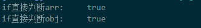

### 如何判断数组Array和对象Object是否为空？

#### (1)if语句中的判断

js 的if 判断实际上是 Boolean(a) ==true 来判断的，先将 a 转化为Boolean 对象 ，然后判断 这个布尔对象是true 还是false。

 ```javascript
 // 判断一个数组是否为空
const arr = [];
if (arr) {
    console.log("if直接判断arr:    ",true);
} else {
    console.log("if直接判断arr:    ",false);
}

// 判断一个对象是否为空
const obj={}
if (obj) {
    console.log("if直接判断obj:    ",true);
} else {
    console.log("if直接判断obj:    ",false);
}
```
结果：



原因：

```javascript
console.log(Boolean(arr)); //true
console.log(Boolean(obj)); //true
```
因此，在写代码时，应注意不要直接通过if(obj)的方式来做判断。

下面，来看看null和undefined
