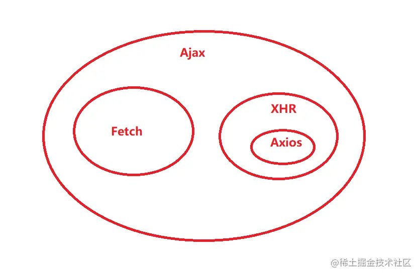
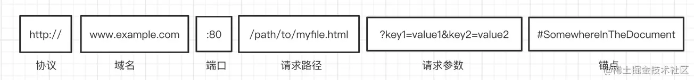

### Ajax

#### Fetch
Fetch提供了一个JS接口，用于处理HTTP请求，该方法简化了从指定URL处获取资源的操作，Fetch返回一个Promise对象
Fetch请求默认不带cookie（可以通过credential:'include'来设置）

#### XHR

### HTTP代理服务器
**作用：**
（1）缓存功能，提高访问速度
（2）过滤（反病毒扫描，家长监护）
（3）负载均衡，让多台服务器服务不同的请求
（4）对不同资源的权限控制
（5）登录，允许存储历史信息

HTTP是无状态有会话的。

### 跨域
什么是跨域？如何解决跨域问题？

#### 同源策略
如果两个页面拥有相同的协议、端口和主机，那么这两个页面就属于同一个源

Img ping  ？？？
img标签也没有跨域显示，但它只能用来发送GET请求，且无法获取服务端的响应文本，可以利用它实现一些简单的、单向的跨域通信，例如跟踪用户的操作

#### 跨域解决办法

### 什么是锚点？