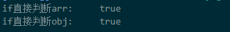

### 如何判断数组和对象？

#### 判断一个参数的数据类型是否是数组
##### Array.prototype.isPrototypeOf()
在JS中,isPrototypeOf()函数用来测试一个对象是否存在于另一个对象的原型链上。

````javascript
console.log(Array.prototype.isPrototypeOf(arr)); //true
console.log(Object.prototype.isPrototypeOf(arr)); //true
console.log(Array.prototype.isPrototypeOf(obj1)); //false
````

##### Array.isArray(arr)
返回一个布尔值，用来表示参数的数据类型是否为数组。

````javascript
const arr=[];
const abj={};
console.log(Array.isArray(arr)); //true 
console.log(Array.isArray(obj)); //false 
````
#### typeof

返回一个字符串，表示未经计算的操作数的类型

````javascript
console.log(typeof (1));                //number
console.log(typeof('1'));               //string
console.log(typeof (undefined));        //undefined
console.log(typeof ([]));               //object
console.log(typeof ({}));               //object
console.log(typeof(true));              //boolean
console.log(typeof(null));              //object
console.log(typeof (function () { }));  //function
console.log(typeof(console));           //object
````
可以发现Array、Object、null使用typeof判断出来的类型都是Object。

*如果我们想要判断一个变量是否存在，可以使用typeof，如果使用if进行判断的话，若变量未生命则会报错。(如下)

````javascript
console.log(typeof (obj));
if (obj) {
    console.log(true);
}

// undefined
// f:\LYJ\笔记整理\JS\typeofAndInstanceOf.js:13
// if (obj) {
// ^
````
#### instanceof
instanceof用于检测构造函数的prototype属性是否出现在某个实例对象的原型链上。

原理：通过Object.getPrototypeOf()方法获取参数的原型对象。顺着原型链去查找，直到找到相同的原型对象。结果返回true和false。

````javascript
let fun = function () { };
let funtest = new fun();
console.log(funtest instanceof fun); //true

let str = new String('xxx');
let str1 = 'xxx';
console.log(str instanceof String); //true
console.log(str1 instanceof String); //false
````


#### typeof和instanceof的区别

① typeof返回变量的基本类型，instanceof返回一个布尔值

②instanceof可以准确地判断复杂引用数据类型，但不能正确判断基础数据类型

③typeof可以判断基础数据类型但引用数据类型中，除function类型外，其他的也无法判断

#### Object.prototype.toString() 通用检测数据类型

````javascript
Object.prototype.toString({})       // "[object Object]"
Object.prototype.toString.call({})  // 同上结果，加上call也ok
Object.prototype.toString.call(1)    // "[object Number]"
Object.prototype.toString.call('1')  // "[object String]"
Object.prototype.toString.call(true)  // "[object Boolean]"
Object.prototype.toString.call(function(){})  // "[object Function]"
Object.prototype.toString.call(null)   //"[object Null]"
Object.prototype.toString.call(undefined) //"[object Undefined]"
Object.prototype.toString.call(/123/g)    //"[object RegExp]"
Object.prototype.toString.call(new Date()) //"[object Date]"
Object.prototype.toString.call([])       //"[object Array]"
Object.prototype.toString.call(document)  //"[object HTMLDocument]"
Object.prototype.toString.call(window)   //"[object Window]"
````

全局通用的数据类型判断方法

````javascript
function getType(obj){
  let type  = typeof obj;
  if (type !== "object") {    // 先进行typeof判断，如果是基础数据类型，直接返回
    return type;
  }
  // 对于typeof返回结果是object的，再进行如下的判断，正则返回结果
  return Object.prototype.toString.call(obj).replace(/^\[object (\S+)\]$/, '$1'); 
}
````

参考 <https://vue3js.cn/interview/JavaScript/typeof_instanceof.html#%E4%B8%80%E3%80%81typeof>

    总结：
    Array.prototype.isPrototypeOf() 返回一个布尔值，可以判断一个变量是否是数组。
    Array.isArray(arr) 返回一个布尔值，表示参数是否是数组类型。
    typeof 可以判断出基本数据的类型，而引用类型数据均为Object，无法区分。
    instanceof 返回一个布尔值，可用来判断钩爪函数的prototype是否在某个实例对象的原型上。
    Object.prototype.toString() 通用检测数据类型。可以正确检测出来所有的数据类型。


### 如何判断数组Array和对象Object是否为空？

注意array=[]和array=null是有区别的
````javascript
// array=[]
if(arrray) //true
//array=null
if(array)  //false
````
#### (1)if语句中的判断

js 的if 判断实际上是 Boolean(a) ==true 来判断的，先将 a 转化为Boolean 对象 ，然后判断 这个布尔对象是true 还是false。

 ```javascript
 // 判断一个数组是否为空
const arr = [];
if (arr) {
    console.log("if直接判断arr:    ",true);
} else {
    console.log("if直接判断arr:    ",false);
}

// 判断一个对象是否为空
const obj={}
if (obj) {
    console.log("if直接判断obj:    ",true);
} else {
    console.log("if直接判断obj:    ",false);
}
```
结果：



原因：

```javascript
console.log(Boolean(arr)); //true
console.log(Boolean(obj)); //true
```
因此，在写代码时，应注意不要直接通过if(obj)的方式来做判断。

下面，来看看null和undefined

```javascript
const arr=[];
const obj={};

arr==='null'; // false 
obj==='null'; // false 

let arr,obj;
arr==='undefined'; // false 
obj==='undefined'; // false 
```
原因，在对比时，会先转为bool类型然后才进行比较。

那么我们来了解一下，Boolean（）函数。
如果省略该参数或参数值为 0、-0、null、false、NaN、undefined，或空字符串（""），则该对象具有的初始值为 false。所有其它值，包括任何对象，空数组（[]）或字符串 "false"，都会创建一个初始值为 true 的对象。
'null'和'undefined'是字符串，所以不能直接比较。

想将对象转为bool值得时候，除了通过Boolean函数，还可以通过 **双重非（!!）** 的方式。

#### （2）判断Array是否为空
[]数组为空即数组的长度为0；
##### Array.length()>0
##### Array==false //true
````javascript
const arr=[];
if(arr==false){
    console.log('数组为空');
}
````

数组和bool类型做比较的时候，会将这两者都转为数字number进行比较。空数组转为number结果为0.

参考 <https://blog.csdn.net/tangxiujiang/article/details/78634028>


#### （3）判断Object是否为空

#####  JSON.stringify(obj)=="{}"
````javascript
console.log(JSON.stringify(obj) == "{}"); //true
````
##### for...in...
````javascript
var fun = function (obj) {
    for (var key in obj) {
        return false;
    }
    return true;
}
objIsNull = fun(obj);
console.log(objIsNull); //true
````

##### Object.getOwnPropertyNmages()
````javascript
var objarr = Object.getOwnPropertyNames(obj);
console.log(objarr.length == 0); //true
````
使用Object.getOwnPropertyNmages()可以获取到对象中的属性名并返回数组对象。判断此数组是否为空，即对象是否为空。

##### Object.keys()  --ES6的新方法

判断对象是否为空，可以通过验证对象的keys长度为0，Object.keys(obj).length===0。
````javascript
var objKeys = Object.keys(obj);
console.log(objKeys.length==0); //true
````
使用Object.keys()可以获取到对象中的属性名并返回数组对象。判断此数组是否为空，即对象是否为空。

参考：  <https://cloud.tencent.com/developer/article/1536958>
        <https://cloud.tencent.com/developer/article/1743491>

    总结：
    判断数组为空：Array.length()==0;
    判断对象为空：
        Object.keys(obj).length()==0; 
        Object.getOwnPropertyNames(obj).length==0