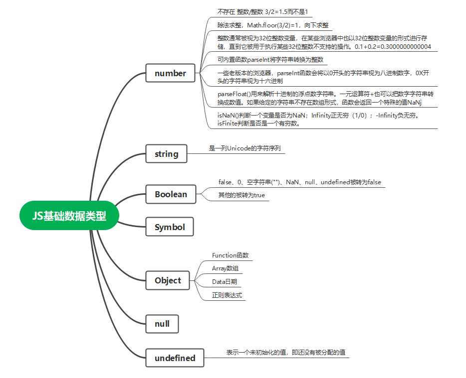
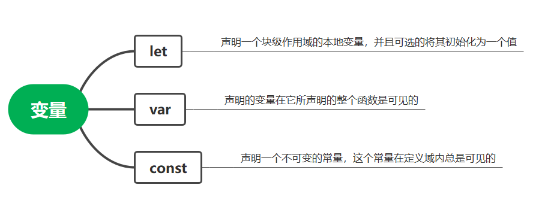
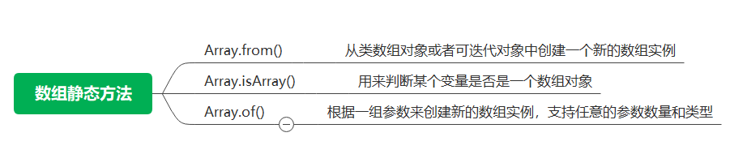
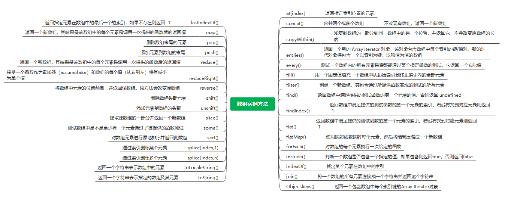
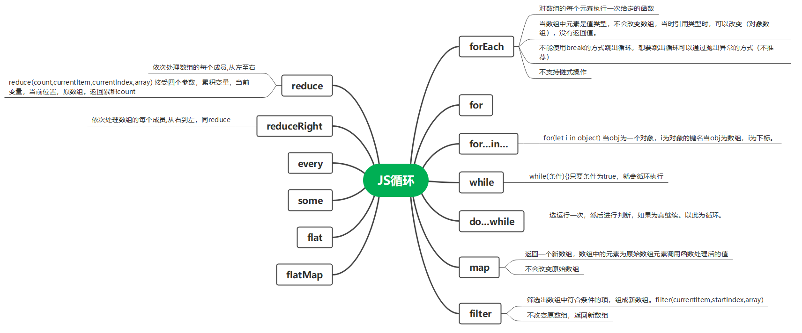
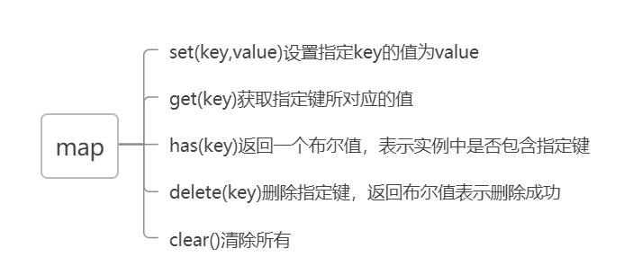
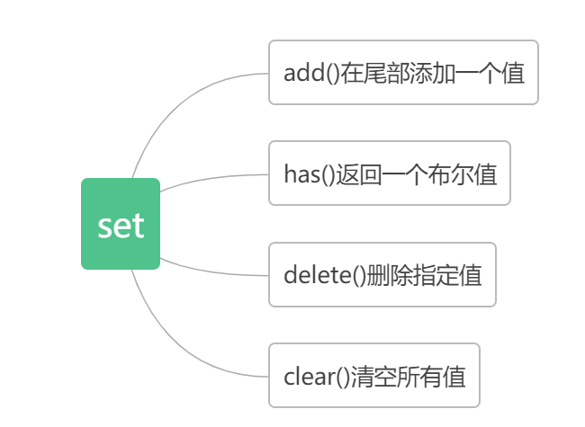
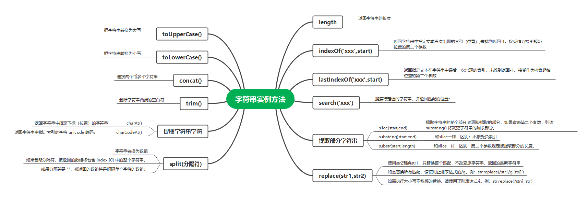

## JS基础

本文主要介绍JS的基本数据类型、常量和变量声明、数组的方法（常用方法和遍历方法）、字符串的方法、字典

## 基本数据类型



**null** 表示一个空值必须使用null关键字才能访问。

**undefined** 表示一个未初始化的值，JavaScript允许声明变量但不对其赋值。

数据类型：值类型数据、引用类型数据
引用类型：对象、数组、函数


## 变量声明

### var\let\const 



ES6之后最好用let声明变量，var有问题。

#### var和let的区别

在for循环的时候使用var进行变量声明，在从上一轮循环进入到下一轮循环的时候变量的值发生改变，这是时所有已声明的var循环变量的值都发生了改变，因为var声明的变量在整个函数都是可用的。
例如：？？

#### 清空变量

在需要清空一个变量值的情况下使用null


#### 静态变量和动态变量
？？

## 数组

参考： < https://developer.mozilla.org/zh-CN/docs/Web/JavaScript/Reference/Global_Objects/Array >

实际上JS是不存在多维数组 ，因为无法直接定义一个多维数组，但JS中的数组元素可以是任意数据类型，可以将数组中的某个元素也设置为数组。


只能用整数作为数组元素的索引，而不能用字符串。

### 数组的静态方法



#### Array.from()
参考： < https://blog.csdn.net/qq_27674439/article/details/108793223 >

从类数组对象或者可迭代对象中创建一个新的数组实例>

    Array.from(object, function, this)
    Object表示要转化为数组的对象。
    function 表示数组中的项调用函数，类似与map
    this 表示上下文，function的上下文


**(1)传入数组，结果返回和原数组一致**

````javascript
const arr = [1, 2, 3, 4, 5, 6]
const objArr = [{ name: 'kk', age: 18 }]
var b = Array.from(arr); //[1, 2, 3, 4, 5, 6]
var b = Array.from(objArr); // [{ name: 'kk', age: 18 }]
````

**（2）传入对象**

对象数组中需要有length属性，且对象的属性名为数值或数字字符串，才会返回非空数组。数组的元素及其下表对应属性名的数值。若不存在，对应位置返回undefined。length表示数组的长度。


````javascript
const obj = { name: 'kk', age: 12 }
const objlength = { name: 'kk', age: 12, 'length': 2 }
var b = Array.from(obj); //[]
var b = Array.from(objlength); //[ undefined, undefined ]
````


````javascript
const sxobj = { 0: 'cn', 1: 'kk', 2: 12 }
const sxObjlength = { 3: 'cn', 1: 'kk', 2: 12, 'length': 2 }
const sxObjlength1={ '1':'cn','0':'kk','2':12, length : 3}
var b = Array.from(sxobj); //[]
var b = Array.from(sxObjlength); //[ undifined, 'kk' ]
var b = Array.from(sxObjlength1); //[ 'kk','cn',  12 ]
````

**（3）传入字符串**

字符串会被分解为一个数组，每个字符代表一个数组元素

````javascript
var b = Array.from('kk'); // [ 'k', 'k' ]
````
#### Array.of()

参考： < https://www.cnblogs.com/littleSpill/p/12003388.html >

此方法根据传入参数的值和顺序创建数组。
````javascript
var b = Array.of()      // []
var b = Array.of(1)     // [ 1 ]
var b = Array.of(1,2)   // [ 1, 2 ]
var b = Array.of('1')   // [ '1' ]
var b = Array.of(undefined) // [ undefined ]
var b = Array.of(null)     // [ null ]
const obj={name:'gg'}
var b = Array.of(obj,obj)   // [ { name: 'gg' }, { name: 'gg' } ]
````
对比Array()

````javascript
var b = Array()      // []
var b = Array(2)     // [ <2 empty items> ]
var b = Array(1, 2)   // [ 1, 2 ]
var b = Array('1')   // [ '1' ]
var b = Array(undefined) // [ undefined ]
var b = Array(null)     // [ null ]
const obj={name:'gg'}
var b = Array(obj,obj)   // [ { name: 'gg' }, { name: 'gg' } ]
````
当参数个数为1且参数类型为数值型的时候，实际上是制定了数组的长度。

### 数组实例方法



````javascript
let arr = [1, 2, 3,]
let arr1 = [4, 5, 6, 5]
let obj = [{ name: 'll', age: 18 }, { name: 'kk', age: 19 }]
const arr3 = [[1, 2], [], [3, 4]];
console.log(arr.at(2), '      原数据', arr);  
// 3 原数据 [ 1, 2, 3 ]   
console.log(arr.concat(arr1), '      原数据', arr);  
// [1, 2, 3, 4, 5, 6, 5] 原数据 [ 1, 2, 3 ]
console.log(arr.copyWithin(1, 0, 2), '      原数据', arr);   
// [ 1, 1, 2 ] 原数据 [ 1, 1, 2 ] 会改变原数组
console.log(Object.entries(arr1), '      原数据', arr1); 
// [ [ '0', 4 ], [ '1', 5 ], [ '2', 6 ], [ '3', 5 ] ] 原数据 [ 4, 5, 6, 5 ]
console.log(Object.entries(obj), '      原数据', obj); 
// [ [ '0', { name: 'll', age: 18 } ], [ '1', { name: 'kk', age: 19 } ] ] 原数据 [ { name: 'll', age: 18 }, { name: 'kk', age: 19 } ]
console.log(arr.every((item) => item > 0), '      原数据', arr); 
// true 原数据 [ 1, 1, 2 ]
console.log(arr.fill(0), '      原数据', arr); 
// [ 0, 0, 0 ] 原数据 [ 0, 0, 0 ] 会改变原数组
console.log(arr1.filter((item, index) => { const test = item + index; return test>6}),'      原数据' ,arr1); 
// [ 6, 5 ] 原数据 [ 4, 5, 6, 5 ]
console.log(arr1.find((item) => item > 4), '      原数据', arr1); 
// 5 原数据 [ 4, 5, 6, 5 ]
console.log(arr1.findIndex((item) => item > 4), '      原数据', arr1); 
// 1 原数据 [ 4, 5, 6, 5 ]
console.log(obj.flat(), '      原数据', obj); 
// [ { name: 'll', age: 18 }, { name: 'kk', age: 19 } ] 原数据 [ { name: 'll', age: 18 }, { name: 'kk', age: 19 } ]
console.log(arr3.flat(), '      原数据', arr3); 
// [ 1, 2, 3, 4 ] 原数据 [ [ 1, 2 ], [], [ 3, 4 ] ]
console.log(arr3.flatMap((item) => item), '      原数据', arr3); 
// [ 1, 2, 3, 4 ] 原数据 [ [ 1, 2 ], [], [ 3, 4 ] ]
console.log(arr3, arr3.join(), '      原数据', arr3); 
// [ [ 1, 2 ], [], [ 3, 4 ] ] 1,2,,3,4 原数据 [ [ 1, 2 ], [], [ 3, 4 ] ]
console.log(Object.keys(arr), '      原数据', arr); 
// [ '0', '1', '2' ] 原数据 [ 0, 0, 0 ]
console.log(arr1.lastIndexOf(5), '      原数据', arr1); 
// 3 原数据 [ 4, 5, 6, 5 ]
console.log(arr1.reduce((total, num) => total - num), '      原数据', arr1);
// -12 原数据 [ 4, 5, 6, 5 ] => 4-5-6-5=-12
console.log(arr1.reduceRight((total, num) => total - num), '      原数据', arr1); 
// -10 原数据 [ 4, 5, 6, 5 ]  => 5-6-5-4=-10
console.log(arr1.sort((a,b)=>a-b),'      原数据' ,arr1); 
// [ 4, 5, 5, 6 ] 原数据 [ 4, 5, 5, 6 ]

````

参考：<https://www.w3school.com.cn/jsref/jsref_copywithin.asp>
#### Array.copyWithin(target, start, end)
    target  必需, 将元素复制到的索引位置。
    start   可选,开始复制元素的索引位置（默认为 0）.
    end     可选,停止从中复制元素的索引位置（默认为 array.length）。
#### Array.flat(depth)

## JS循环

参考：<https://blog.csdn.net/qq_41899174/article/details/82797089>



foreach，map，filter循环中途是无法停止的，总是会将所有成员遍历完。

## map和set
### map
    map类似于对象，是键值对的集合
    new Map()




**使用map能重构一个数组**
比如有一个数组[1,nll,2,null]
想要去除undefined的项实现[1,2]

一个对象数组按照name数组的排列去排序
````javascript
const _fields: any[] = [];
  fieldOptions.value.forEach((t) => {
    const index = fields.indexOf(t.name);
    if (index > -1) {
      _fields[index] = { name: t.name, aliasName: t.label };
    }
  });
````
一个对象数组按照name数组的排列去排序


### set
    set类似数组，但其中元素的值是唯一的，向其中添加重复的值时会被忽略
    利用set可以很好的进行数组去重，set通过size属性获得其中元素的数量

    new Set()



## JS字符串方法

split()字符串方法，对数组无效

参考：<https://www.w3school.com.cn/js/js_string_methods.asp>



## Lodash
Lodash 是一个一致性、模块化、高性能的 JavaScript 实用工具库。