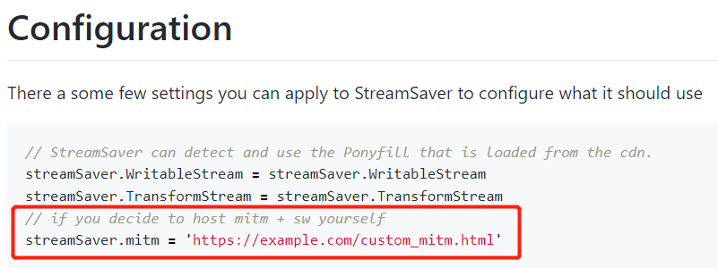
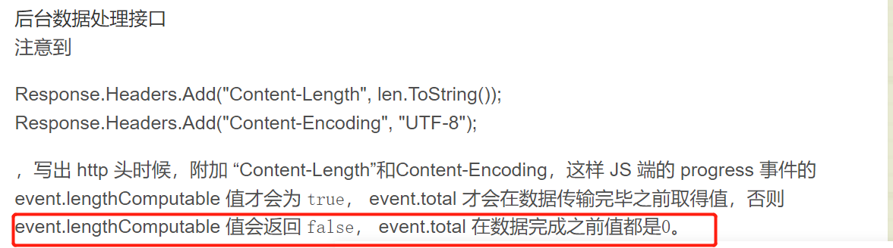
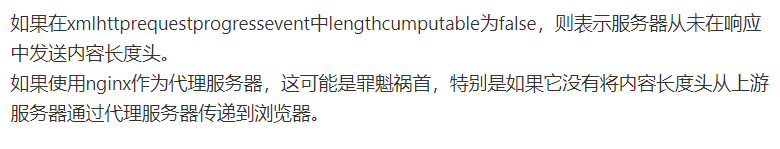

### 文件下载的方法总结
#### 方法一
通过创建a标签来对文件进行下载。需要注意的是，a标签的地址指向。

①当需要下载的是单个文件的时候（包括.zip），直接使得a.href指向文件地址（或者get方法请求的文件接口地址），便可以触发浏览器对文件进行下载。这种方式将文件下载的控制权交给了浏览器，浏览器会自动管理文件流，会自动生成进度条、停止、继续、取消下载按钮等。


② 通过ajax的方式获取文件流，通过createObjectURL方法创建一个文件对象URL，然后在通过a标签访问实现下载。这种方法可以用来实现文件夹的下载，应用可对下载进度进行监控，或者想在某个下载节点触发特定事件。缺点是这种在前端将文件流转为文件对象，不是实体文件，没有prosssess进程计算下载进度，因此会出现点击下载后，不显示文件下载，直到请求结束后直接显示下载文件，在要下载文件很大的时候，在点击下载和显示下载中间有很长的一段空白时间，用户不知道文件是否下载中。

````javascript
/**
 * 下载服务
 */
function handleDownload(e: any, row: any) {
  e.stopPropagation();
  getDownload(row.serviceId, row.serviceName)
    .then((res: any) => {
      const { data } = res;
      createToDownloadFile(data.data, data.fileName);
    })
    .finally(() => {});
}

function createToDownloadFile(data: Blob, fileName: string): void {
  let domHref: HTMLAnchorElement | null = document.createElement('a');
  const binaryData = [];
  binaryData.push(data);
  // createObjectURL会创建一个DOMString,其中包含一个表示参数中给出的对象的URL。这个新的URL对象表示指定的File对象或者Blob对象。这个 URL 的生命周期和创建它的窗口中的 document 绑定
  //Blob参数是一个File对象或者Blob对象
  const blobUrl = window.URL.createObjectURL(new Blob(binaryData));
    // 这里指定了type为zip类型，如果不指定了话，在下载文件夹的时候，转为单个文件对象。
  // const blobUrl = window.URL.createObjectURL(new Blob(binaryData, { type: 'application/zip' }));

  domHref.href = blobUrl;
  domHref.download = fileName;
  domHref.click();
  domHref = null;
  //window.URL.revokeObjectURL释放对象所占用的内容。
  window.URL.revokeObjectURL(blobUrl);
}
````
Blob对象是包含有只读原始数据的类文件对象。使用blob需要注意的是，responseType的值需为blob。使用ajax下载文件 ，再将文件保存为blob对象，缓存在浏览器中，然后使用URL.createObjectURL生成一个虚拟的URL使当前用户可以访问和下载到这个对象。此下载方式是客户端内部的，不走网络io,因此下载时瞬时的。注意在生成完虚拟url之后，需要将其释放，否者blob不会被垃圾回收。

#### 方法二
项目中要下载的是文件夹且要求显示进度。因此尝试使用了插件streamSaver。需要注意的是，使用streamSaver要使用fetch的方法请求接口。使用axios进行文件下载，需等待整个文件流都下载到内存中才会弹出浏览器的下载文件保存对话框。使用streamSaver进行文件下载，在生产环境中，会预先弹窗后才下载。

文件下载
````javascript
/**
 * 下载服务
 */
function handleDownload(e: any, row: any) {
  e.stopPropagation();
  getDownload(row.serviceId, row.serviceName)
    .then((res: any) => {
      const fileStream = streamSaver.createWriteStream(`${row.aliasName}.zip`, {
        size: res.headers.get('content-length'),
      });
      const readableStream = res.body;
      if (window.WritableStream && readableStream.pipeTo) {
        return readableStream.pipeTo(fileStream).then(() => console.log('done writing'));
      }
      window.writer = fileStream.getWriter();
      const reader = res.body.getReader();
      const pump = () =>
        reader
          .read()
          .then((res: any) =>
            res.done ? window.writer.close() : window.writer.write(res.value).then(pump),
          );
      pump();
    })
    .finally(() => {});
}
````
Fetch请求
````javascript
import { baseUrl, SmartResponse } from './config';
import { getTokenItem } from '@/utils/localStorage';

export const FetchFile = (url: string, params?: any, options: any = {}) => {
  const { timeout = 3000, ...arg } = options;
  let requestUrl = `${baseUrl + url}`;
  const paramsArray = [] as any;
  Object.keys(params).forEach((key: any) => paramsArray.push(`${key}=${params[key]}`));
  if (requestUrl.search(/\?/) === -1) {
    requestUrl += `?${paramsArray.join('&')}`;
  } else {
    requestUrl += `&${paramsArray.join('&')}`;
  }
  return new Promise<SmartResponse>((resolve, reject) => {
    fetch(requestUrl, {
      timeout: timeout,
      method: 'GET',
      ...arg,
      headers: {
        Authorization: `Bearer ${getTokenItem()?.access_token}`,
        'Content-type': 'application/json',
      },
    })
      .then((res: any) => {
        if (!res.ok) {
          throw new Error('fetch file error');
        }
        resolve(res);
      })
      .catch((err: any) => {
        reject(err);
      });
  });
};

````
使用此方法在生产环境中遇到了找不到mitm资源的问题。可以在组件中指定此文件资源的正确地址。

#### 方法三
自己计算进度然后使用el-progress显示进度


````javascript
//计算下载进度函数
function progressFun(progressEvent: any) {
  if (progressEvent.lengthComputable) {
    state.downRowList.set(state.downLoadId, {
      progress: Math.floor((progressEvent.loaded / progressEvent.total) * 100),
    });
  } else {
    state.downRowList.set(state.downLoadId, { process: -1 });
  }
}
// axios请求
axios
  .get(url, {
    timeout: timeout,
      ...arg,
      params: {
        ...params,
      },
      //下载进度
      onDownloadProgress: progressFun, 
      //onUploadProgress上传进度
    })
    .then((res: AxiosResponse) => {
      resolve(res?.data);
    })
    .catch((err: AxiosError) => {
      reject(err);
    });

````
progressEvent.lengthComputable表示progressEvent所关联的资源是否具有可以计算的长度，这里需要后端在response头中放回正确的content-length。progressEvent.loaded表示正在加载的进度，progressEvent.total表示要下载的总的大小。

导致lengthComputable为false的原因有：
（1）

（2）


总结：项目中使用了axios中的onDownloadProgress方法进行下载进度的计算，并使用map()存储。

````text
参考：
（1） https://www.cnblogs.com/laden666666/p/6409868.html
````