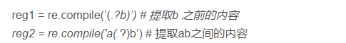

## 正则表达式
提取str1之前的内容

已知一个url如下：
````javascipt
Url='http…../layer?tableName=poitable&level=1"
````
需要把接口和参数tableName提取出来。
````javascipt
const geoUrl = node.url.match(/(\S*)([?]tableName)/)[1];
    const tableName = node.url.match(/(?<=tableName=).*?(?=&level)/)[0];
````
