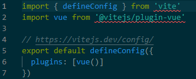

### vite
大型应用存在的问题：

开发服务器启动需要很长的是时间，修改文件修改后的效果也需要几秒才能在浏览器中反映出来。
vite旨在利用生态系统中的新进展解决上述问题。
### 从头搭建一个vue项目vue3+vite+ts

#### 1、查看

首先查看node和npm版本。

    node -v
    npm -v
#### 2、全局安装vite

    npm install -g create-vite-app

#### 2、创建项目
    create-vite-app vue3-vite （不需要自己选，默认配置）
    npm init @vitejs/app （可自选配置）
#### 3、安装依赖插件
    npm install 或 yarn install 
    yarn add -D eslint eslint-plugin-vue
    npm install -D typescript

#### 修改vite.config.ts文件
    vite配置文件
    vite.config.ts：项目的全局配置文件，启动时会自动读取该文件。
    配置：@指向src目录、服务端口、打包路径、代理等。
    官网：<https://vitejs.dev/config/>

#### 集成路由
    安装支持vue3的路由npm i vue-router@4

    在main中挂载路由

## 遇到的问题
vite.config.ts文件报错：

找不到模块“vite”或其相应的类型声明。

找不到模块“@vitejs/plugin-vue”或其相应的类型声明。

重新安装node_modules时需要重新打开项目。

参考: 

<https://blog.csdn.net/XH_jing/article/details/112232930>

<https://juejin.cn/post/6973288527802925092> 

<https://blog.csdn.net/weixin_41639609/article/details/121991964>