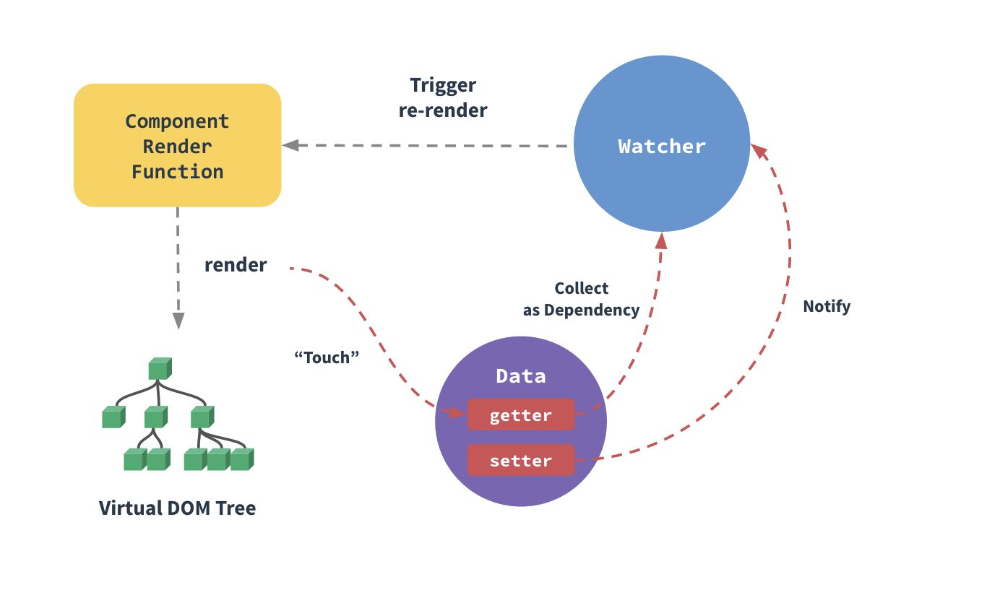
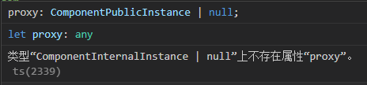

# VUE
vue是一套用于构建用户界面的渐进式框架。vue被设计为自低向上逐层应用。vue的核心库只关注视图层。
（渐进式，由浅入深，简单到复杂）
优点：
体积小
运行效率高（虚拟dom操作）
双向数据绑定
生态丰富，学习资料多
## 模板语法
### 插值
数据绑定：
（1）双花括号的文本插值
（2）v-once指令：一次性插值，当数据改变时，插值处的内容不会更新
（3）v-html：输出真正的HTML.

### VUE指令

指令是带有v-前缀的特殊attribute。其预期值是单个JS表达式
（1）参数：在指令名称后以冒号表示
（2）动态参数：用方括号括起来JS表达式
（3）修饰符：以半角句号.指明的特殊后缀，用于指出一个指令应该以特殊方式绑定。（指令对于触发的事件调用某方法）

v-on指令：添加一个事件监听器，通过它调用在vue实例中定义的方法
v-model指令：实现表单输入和应用状态之间的双向绑定
v-show
v-if

#### v-show和v-if

v-show隐藏是为元素添加了display:none ，dom元素还在。不会触发组件的生命周期。
v-if是将元素添加或者隐藏。v-if由false变为true的时候，触发组件的beforeCreate、create、beforeMount、mounted钩子，由true变为false的时候触发组件的beforeDestory、destoryed方法
性能消耗：v-if有更高的切换消耗；v-show有更高的初始渲染消耗
如果需要非常频繁地切换，则使用 v-show 较好

如果在运行时条件很少改变，则使用 v-if 较好
#### v-if和v-for不建议一起用
v-for优先级比v-if高。
故：
1、永远不要把 v-if 和 v-for 同时用在同一个元素上，带来性能方面的浪费（每次渲染都会先循环再进行条件判断）
2、如果避免出现这种情况，则在外层嵌套template（页面渲染不生成dom节点），在这一层进行v-if判断，然后在内部进行v-for循环
3、如果条件出现在循环内部，可通过计算属性computed提前过滤掉那些不需要显示的项

v-lazy 
描述：图片懒加载指令。
作用：不需要一次性加载所有的图片，避免在同一时间加载大量的图片。也就是当图片滚动到可是区域的时候再去加载图片。
## Vue项目目录
### 1、public/index.html
pubilc/index.html是一个模板文件，作用是生成项目的入口文件，webpack打包的js,css也会自动注入到该页面中。我们浏览器访问项目的时候就会默认打开生成好的index.html。
index.html是一个总的入口文件，vue是单页面应用，挂在id为app的div下然后动态渲染路由模板

参考：
 <https://segmentfault.com/q/1010000020213973> 

## 一些对象
Data对象：vue中的data方法中返回的对象；

Dep对象：每一个Data属性都会创建一个Dep，用来搜集所有使用到这个Data的Watcher对象；

Watcher对象：组件视图对象，主要用于渲染DOM

### Data Property
组件的data选项是一个函数。vue在创建新组件实例的过程中调用此函数。它返回一个对象，vue会通过响应性系统将其包裹起来，并以$data的形式存储在组件实例中
methods：向组件添加方法

 
## vue更新DOM的原理
Vue中的数据更新是异步的,当数据变化的时候，vue会开启一个队列缓存在同一事件循环中发生的所有数据改变。（同一个watcher被多次触发，只会被推入到队列中一次）。在修改完之后，不会立刻重新渲染DOM。

1、修改 Vue 中的 Data 时，就会触发所有和这个 Data 相关的 Watcher 进行更新。
2、首先，会将所有的 Watcher 加入队列 Queue。
3、然后，调用 nextTick 方法，执行异步任务。
4、在异步任务的回调中，对 Queue 中的 Watcher 进行排序，然后执行对应的 DOM 更新。

在vue的nextTick回调中能获取最新的DOM
$nextTick 能够获取更新后的DOM

参考：

<https://zhuanlan.zhihu.com/p/364479245>

## vue实例挂载过程

new vue()这个过程做了些啥？如何完成数据绑定的？如何将数据渲染到视图的？

new Vue的时候调用会调用_init方法

定义 $set、$get 、$delete、$watch 等方法
定义 $on、$off、$emit、$off等事件
定义 _update、$forceUpdate、$destroy生命周期
调用$mount进行页面的挂载

挂载的时候主要是通过mountComponent方法

定义updateComponent更新函数

执行render生成虚拟DOM

_update将虚拟DOM生成真实DOM结构，并且渲染到页面中

## vue响应式原理

Observe负责将数据转换成getter/setter形式
Dep负责管理数据的依赖列表，是一个发布订阅模式，上游对接Observer，下游对接Watcher。
Watcher实际上是数据依赖，负责将数据的变化转化到外界（渲染回调）
首先将data传入Observe转成getter/setter形式，当watcher读数据时，会触发getter，被收集到Dep仓库中；当数据更新时，触发setter通知Dep仓库中的所有watch更新，watch实例负责通知外界。

## props

对于props声明为驼峰法，template子组件的使用可以用中划线“—”连接，小写HTML不区分大小写，驼峰命名均会转为小写，使props声明和传递的值不对应
命名规范：
（1）在父组件的template中，template中子组件的使用应该用‘-’中划线写法，均为小写
（2）子组件props属性声明时，使用小驼峰或者中划线写法都可以
vue能够正确识别出小驼峰和下划线命名法混用的变量。

定义事件的时候，最好命名都为小写

## 在函数里写setup和<script setup lang='ts'>
Vue3执行时机，setup是在beforeCreate之后，created之前执行的。

参考：
<https://juejin.cn/post/7052531217333223437>

<https://juejin.cn/post/7031565983269519367#heading-7>

## router
### 路由懒加载？

## vue生命周期
vue实例在被创建时都要经历一系列初始化过程：设置数据监听、编译模板、将实例挂载到DOM并在数据变化时更新DOM等

周期：开始创建->初始化数据->编译模板->挂载Dom->渲染、更新->渲染、卸载
组件创建阶段
①beforeCreate：实例化被完全创建出来之前，这时data和method都没有初始化，不可以调用他们。
②create：这时data和method都已经完成了初始化。在模板渲染成HTML之前调用，即通常初始化某些属性值，然后再渲染成视图。
③beforeMount：模板在内存中已编辑但尚未渲染到页面中
④Mount：实现创建期间的最后一个生命周期函数。mount不返回应用本身，相反，它返回的是根组件实例。
组件运行阶段：在模板渲染成HTML后调用，通常是初始化页面完成后，再对HTML的dom节点进行一些需要的操作。
⑤beforeUpdata：这是再组件运行阶段的钩子，这时页面中的数据显示的是旧数据，但是组件中的data是最新的，页面和data还没有完成同步。
⑥update：data和页面完成同步。data和页面都是最新。
组件销毁阶段：
⑦beforeDestory：还没有真正执行销毁过程，过滤器等都还可用。
⑧Destory：组价已销毁，数据、过滤器、函数等都不可用了
Keep-alive 独有的生命周期：activated和deactivated的。用keep-alive包裹的组件在切换时不会进行销毁，二十缓存到内存中并执行deactivated钩子函数，命中缓存渲染后会执行activated钩子函数。
Keep-alive是vue中的内置组件，能在组件切换过程中将状态保留在内存中，防止重复渲染DOM
使用原则：当我们在某些场景下不需要让页面重新加载时，我们可以使用keepalive

### 数据请求在created和mouted的区别
created是在组件实例一旦创建完成的时候立刻调用，这时候页面dom节点并未生成；mounted是在页面dom节点渲染完毕之后就立刻执行的。触发时机上created是比mounted要更早的，两者的相同点：都能拿到实例对象的属性和方法。 讨论这个问题本质就是触发的时机，放在mounted中的请求有可能导致页面闪动（因为此时页面dom结构已经生成），但如果在页面加载前完成请求，则不会出现此情况。建议对页面内容的改动放在created生命周期当中。
## 事件总线event bus

父子组件通信：父组件通过props向下传数据给子组件，当子组件有事情要告诉父组件时会通过$emit事件告诉父组件。
当两个页面没有任何引入和被引入关系时，该如何通信？
答：如果应用程序不需要类似vuex这样的库来处理组件之间的数据通信，可以考虑使用事件总线来通信
如何使用事件总线？？
①初始化--首先需要创建事件总线并将其导出，以便其他模块可以使用或者监听它。

## 组件通讯
### 父组件向子组件传值
props：父组件向子组件传值。
父组件使用v-bind绑定要传递给子组件的数据。
子组件通过props接受父组件传递下来的值。

父子组件通信：B组件引入到A组件里渲染，A为父，B为子。
B组件的一些数据需要从A组件拿，B组件有时也要告知A组件一些数据变化情况。B是直接挂载在A下的。

### 子组件向父组件传值

$emit 绑定一个自定义事件，当这个事件被执行的时候就会将值传递给父组件，而父组件通过v-on监听并接受参数。

Vue 跨组件通信方式
①A（父）通过prop向B（子）传值（可包含父级定义好的函数）
②B（子）通过emit向A（父）触发父组件事件执行
（1）下发props
下发过程实在A里完成的，父组件在向子组件下发props之前，需要导入子组件并启用它作为自身的模板，然后在setup里处理好数据，return给template
然后在A这边拿到return出来的数据，把要传递的数据通过属性的方式绑定在template的组件标签上
注：在prop在template统一采用短横线分隔命名，但采用驼峰也是可以正确拿到值。
（2）接收props
在B中完成，在script部分，子组件通过与setup同级的props来接收数据。
带有类型限制的props：（TS）
推荐的方式是把props定义为一个对象，以对象形式列出prop
注：和ts类型定义不同，props里的类型，首字母需要大写
（3）使用props，在vue2中通过this来使用父组件传下来的prop，在vue3中通过给setup添加一个参进行操作setup（props）{}
注：prop只读，不允许被修改，如果在B中没有定义，但父组件那边非要传过来，是不会拿到的，且控制台没有警告信息
（4）传递非prop的Attribute
在父组件，除了可以给子组件绑定props，还可以根据实际需要去绑定一些特殊的属性。
例：给子组件设置class、id或者data-XXX之类的 自定义属性，如果子组件的template只有一个根节点，这些属性默认自动继承，并渲染在node节点上。
可以在child.vue配置inheritAttrs为false，来屏蔽这些自定义属性的渲染
（5）获取非prop的attribute
在子组件里，通过setup的第二个参数context里的attrs来获取到这些属性
（6）绑定emits
子组件如果需要向父组件告知数据更新，或执行某些函数时，是通过emits来进行的
动态绑定props是用：，绑定emit是用
emits可以是数组/对象
子组件将自定义向上级透传的方式

reactive是vue中提供的实现响应式数据的方法
它的参数必须为对象（json/arr）
如果给reactive传递了其它对象，默认情况下，修改对象，无法实现界面的数据绑定更新
如果需要更新，需要进行重新赋值。（即不允许直接操作数据，需要方格新的数据来替代原数据）

### 父子组件和非父子组件之间通信

eventBus事件总线（$emit/$on)

（1）创建事件中心管理组件之间的通信

### Injecthe provide
作用：用于父组件向子孙组件传递数据
使用方法：provide在父组件中返回要传递给下级的数据
inject在需要使用这个数据的子辈组件或孙辈等下级组件中注入数据。

总结：
    组件间共享数据方式：
    父向子传值：v-bind属性绑定
    子向父传值：v-on 事件绑定
    兄弟间共享数据：EventBus   （$on接收数据的那个组件；$emit发送数据的那个组件）

## vue3动态组件的使用

 组件：在vue中，一个组件本质上是一个拥有预定义选项的一个vue实例。

 <component :is="componentName"></component>
is的值是哪个组件的名称，就显示哪个组件

<template>保留页面加载时隐藏的内容
如果有一些需要重复使用的HTML代码，则可以使用<temlate>代码

## Vue中全局组件的注册使用
我们经常会在利用Vue开发的项目中，多次重复使用某一段代码结构，这就需要我们把它封装成公共组件，注册在全局进行多次复用。

参考：
<https://blog.csdn.net/weixin_57246557/article/details/119764169>

## $用来区分用户定义的property和vue实例暴露的实例与方法？？

vue中的$符号：
在vue所有实例中都可用的属性的一个简单约定，这样做会避免和已定义的数据、方法、计算属性产生冲突
（便于与用户自己定义的属性区分开来）
## 计算属性computed和侦听器watch
计算属性
定义：要用的属性不存在，要通过已有属性计算得来
原理：底层借助了object.defineproperty方法提供的getter和setter
计算属性没有正在的值每次都是通过计算得出的。
计算属性computed：已知属性进行计算得到的一个属性
计算属性定义：get()，当有人读取计算属性时，get就会被调用，返回值就是计算属性值 
Get()调用：初次读取计算属性时，所依赖的数据发生变化时
Set()调用：当计算属性被修改时
计算属性与方法
计算属性内部有缓存机制，效率更高，调试方便
如果计算属性要被修改，必须写set函数去响应修改，且set中要引起依赖属性的变化
模板初衷是用于简单运算。在模板中放入太多的逻辑会让模板过重且难以维护。
对于任何包含响应式数据的复杂逻辑，应使用计算属性
计算属性简写：
直接把计算属性写成一个function。当只有get没有set时才能简写
计算属性缓存compute
计算属性是基于它们的响应依赖关系缓存的。
侦听器（监视）
watch：
handler函数，计算属性或者属性被修改时调用。有newValue和oldValue
Immednate:初始化的时候让handle调用一下
监视属性必须存在才能监视

侦听器：当需要在数据变化时执行异步或开销较大的操作时
侦听属性：有一些数据需要随着其它数据变动而变动时
一个通用的方式来观察和响应当前活动的实例上的数据变动=>侦听属性
当模板中没有到已有属性和计算属性时。
深度监视：

## 绑定class/class与style绑定
绑定class样式：
（1）字符串写法。适用于，样式名不确定，需要动态绑定
（2）数组写法。要绑定的样式，个数不确定，名字也不确定
关于前端token校验，需要优化下，说下思路
1.额外开发一个login页面（不需要UI），该页面用于模拟登录获取token，默认会进入该页面，登录成功后自动跳转到home页面，同时将token存储到localstorage和vuex中。
2.在路由处增加拦截，当路由为login页面时，直接进入即可，其他页面需要判断token是否存在，如果不存在则跳转回登录页面，然后重复1步骤。
3.在axios封装js中，请求拦截将本地存储中的token设置在请求头中
4.在axios封装中，当后端返回状态码为202时，清空本地存储和vuex中的token，并跳转回登录页面，重复1步骤

## import和@import的区别及使用场景
import：script中的import是js语法，是在js中去引用css文件
ES6模块化规范：默认导入语法import接收名称from”模块标识符“
@import：style中的@import是stylus的语法，是在css中引用css文件。

## ref、toRef、toRefs
This.$refs是一个对象，持有当前组件中注册过ref特性的所有DOM元素和子组件实例
ref获取本页的dom元素，还可以拿到子组件中的data，调用子组件中的方法.
### toRef和toRefs的区别
Ref用于创建一个响应式数据，如果用ref函数将某个对象中的属性变成响应式数据，修改响应式数据是不会影响到原始数据。（ref的本质是拷贝，而不是引用）
toRef也可以创建一个响应式数据。如果使用toref将某个对象中的属性变成响应式数据，修改响应式数据会影响到原始数据。注意：如果修改通过toRef创建的响应式数据，并不会触发UI界面的更新（toRef的本质是引用，于原始数据有关联）
toRef接受一个对象作为参数，它会遍历对象身上的所有属性，然后挨个调用toref执行
toRef 转换响应式对象中某个属性为单独响应式数据，并且值是关联

toRefs转换响应式对象中所有属性为单个响应式对象，数据对象为普通对象，且值是关联的。
使用toRef或toRefs，就能实现mapState、mapGetters效果

参考：
 <https://blog.csdn.net/weixin_41364246/article/details/117572374> 

 ## vue状态管理
 vue应用中响应式data对象的实际来源：当访问数据对象时，一个组件实例只是简单的代理访问。
如果有一处需要被多个实例间共享的状态，可以使用以恶个reactive方法让对象作为响应式对象。

vuex专门为vue.js应用程序开发的状态管理模式。
采用集中式存储广利应用的所有组件的状态，并以相应的规则保证状态以一种可预测的方式发生改变
vuex是实现组件全局状态（数据）管理的一种机制，可以方便的实现组件之间的数据共享
存储在vuex中的数据都是响应式的，能够实时保持数据与页面的同步
适合存储到vuex中的数据：一般情况下只有组件之间才共享数据，才有必要存储到vuex中，对于组件中的私有数据，依旧存储在组件自身的data中即可。

## vue中this的替代方案

Vue3执行时机，setup是在beforeCreate之后，created之前执行的。
setup再生命周期beforecreate和created前执行，此时vue对象还没有创建，因此无法使用我们在vue2.X中常使用的this
解决办法是vue中的getCurrentInstance方法返回了cts和proxy，可以使用proxy进行替代
 getCurrentInstance获取当前组件的实例
cts或proxy属性获得当前上下文
Vue+ts会出现问题

解决办法：
参考：<https://cn.bing.com/search?q=%E7%B1%BB%E5%9E%8B%E2%80%9CComponentInternalInstance+%7C+null%E2%80%9D%E4%B8%8A%E4%B8%8D%E5%AD%98%E5%9C%A8%E5%B1%9E%E6%80%A7%E2%80%9Cproxy%E2%80%9D&qs=n&form=QBRE&sp=-1&pq=%E7%B1%BB%E5%9E%8B%E2%80%9Ccomponentinternalinstance+%7C+null%E2%80%9D%E4%B8%8A%E4%B8%8D%E5%AD%98%E5%9C%A8%E5%B1%9E%E6%80%A7%E2%80%9Cproxy%E2%80%9D&sc=0-49&sk=&cvid=CC9CFD0BECF14DC3AD8FB6E69F339C75>

## Mixins
在组件开发过程中，常会遇到一些具有相同逻辑和功能的组件。如果每个组件各写一头方法回导致代码冗余。后期更改是时候也要一个个修改，浪费事件
mixins将这些多个相同的逻辑抽离出来，各个组件只需要引用mixins就能实现一次写代码，多组件受益的效果
Mixins使用
（1）用一个文件将将vue的script部分抽离出来
（2）需要时在组件中引入即可
特性：
（1）mixins中的生命周期会与引入mixin的组件的生命周期整合在一起调用
（2）组件中的data\methods\filter会覆盖mixins中同名的
（3）不同mixins里面的同名方法会按引进顺序，最后的覆盖前面的同名方法
缺点：
（1）变量的来源不明确
（2）多个mixins的生命周期会融合到一起运行，但是同名属性、同名方法无法融合，可能会导致冲突
（3）mixins和组件可能出现多对多的关系，复杂度较高
vue3中使用Composition API进行类似于react hook式的函数式组件开发，替代了mixinx，能更好的进行逻辑代码提取及复用，其思想是将功能定义为从setup函数返回的变量，而不是像vue2中将功能定义为对象属性。
Vue2的mixins和vue3的mixins ??? (vue3基础笔记未完成)

## 路由router

path路径，name路径别名
path是路径，还可以有耳机路径，如path：‘：/sysem/setting’
name无二级，相当于给path去一个别名方便记住

router之fullpath
路由跳转其实具有刷新功能
fullpath能缓存路由跳转后面携带的参数（刷新后依旧存在）
而path不能缓存跳转后携带的参数。故path能在只有两层数据结构的移动端起作用

$router 路由操作对象，只写对象，push(),replace(),go()
$route 路由信息，对象，只读对象
path和name跳转方式，都可以用query传参
而path方式，params传参会被忽略，只能用name
直白的说，query相当于get请求页面跳转时，可在地址栏看到请求参数，而params相当于post，参数不会在地址栏显示。

前置路由和后置路由
    前置路由：
    router.beforeEach((to, from, next) => { 
    // to:要去哪个页面
    // from:从哪里来
    // next:它是一个函数。
    // 如果直接放行 next() 
    // 如果要跳到其它页 next(其它页) })

v-loading使用
集成vuex
在vue3 中使用pinia数据存储工具
它具有轻量化、体量小的特点
但是不可以实现时间旅行
Npm I-D pinia@next

登录页面
首先是要有输入用户名和登录密码的
那么引入element-ui
注意vue2和vue3所使用的也有所不同
Vue3中使用element-plus

需要配置eslint
需要配置sass
需要配置svg

