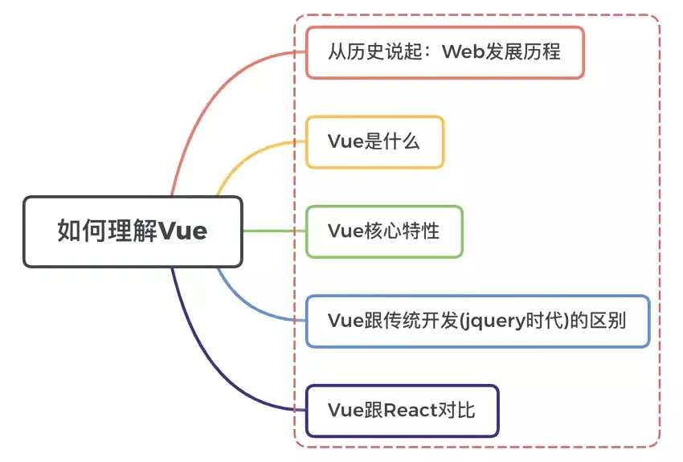

参考： < https://vue3js.cn/interview/vue/vue.html#%E4%B8%80%E3%80%81%E4%BB%8E%E5%8E%86%E5%8F%B2%E8%AF%B4%E8%B5%B7 >
## 对vue的理解

### web发展历史

### vue是什么

vue是一个用于船检用户界面的开源JS框架，也是一个创建单页面应用的web应用框架。

### Vue的核心

#### vue是一个MVVM框架。

model：模型层，负责处理业务逻辑以及和服务器端进行交互

view：视图层，负责将数据模型转化为UI展示出来，可以简单的理解未HTML页面。

viewModel：视图模型层，用来连接model和view，是model和view之间通信桥梁
#### 组件化

组件化就是把图形和非图形的各种逻辑抽象成为一个统一的概念来实现开发的模式。

组件化降低了系统的耦合度，在保持接口不变的情况下，可以替换不同的组件快速完成需求。在出现问题时，可以较为容易的快速定位到某个组件。可维护性高。

### 指令系统

常用的指令

条件渲染指令 v-if
列表渲染指令v-for
属性绑定指令v-bind
事件绑定指令v-on
双向数据绑定指令v-model

### vue和传统的Jquery的区别是

Vue所有的界面事件，都是只去操作数据的，Jquery操作DOM

Vue所有界面的变动，都是根据数据自动绑定出来的，Jquery操作DOM

### vue和react的区别

数据流向的不同。react从诞生开始就推崇单向数据流，而Vue是双向数据流

数据变化的实现原理不同。react使用的是不可变数据，而Vue使用的是变的数据（响应式数据）

组件化通信的不同。react中我们通过使用回调函数来进行通信的，而Vue中子组件向父组件传递消息有两种方式：事件和回调函数

diff算法不同。react主要使用diff队列保存需要更新哪些DOM，得到patch树，再统一操作批量更新DOM。Vue 使用双向指针，边对比，边更新DOM

## SPA单页面应用

