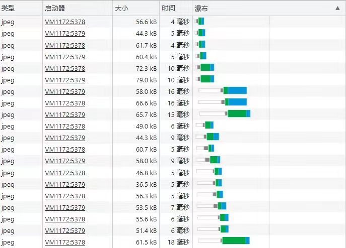

## 浏览器 问答题

**1、浏览器缓存机制有哪些缓存方式及区别**

``` text    
答：浏览器会在第一次向服务器发起请求后，根据响应报文中的HTTP头的缓存报文决定是否缓存结果和缓存处理的方式。缓存的方式有强缓存和协商缓存两种:
    （1）强缓存
    强缓存直接从缓存中读取资源。
    （2）协商缓存
    协商缓存由服务器决定缓存资源是否可用，在强缓存失效后，浏览器携带缓存标识向服务器发起请求，服务器根据表示决定是否使用缓存。
    强缓存和协商缓存两者的区别：
    强缓存和协商缓存虽然都是从客户端中读取资源，但是强缓存不会向服务器发送请求，而协商缓存会向服务器发送请求。
```

**2、下图为某次操作后的图片请求，请解释下以下请求为何不是同时进行？若想同时进行请求如何处理？**


浏览器并不一定会对每个资源开个连接去请求加载，是有并发限制的。

也并不是浏览器限制并发了，我们就没别的办法了。提升页面打开速度的技术有很多，常见的：

domain hash：对资源做哈希，请求到不同的域下面。
cookie free：前后端分离，减少不必要的cookie提交。
css sprite：将零星的图片整合到一张大图中，减少请求次数。
js/css combine：资源合并，减少请求次数，不过也会增加文件修改的几率。
max expires time：合理设置客户端缓存时间。
loading images on demand：图片按需加载。

页面资源请求时，浏览器会同时和服务器建立多个TCP连接，在同一个TCP连接上顺序处理多个HTTP请求。所以浏览器的并发性就体现在可以建立多个TCP连接，来支持多个http同时请求。

Chrome浏览器最多允许对同一个域名Host建立6个TCP连接，不同的浏览器有所区别。

``` text
答:
```

## css 问答题

**1、下图如何通过定位或布局实现?(以黑线分隔，上方固定于浏览器顶部,且脱离标准流。下方整体占满浏览器(左右区域固定宽度，中间占满剩余宽度))**
``` text
答：（1）上方固定于浏览器顶部，脱离标准流；
        position: fixed;

    (2)下方整体占满浏览器(左右区域固定宽度，中间占满剩余宽度)
        左：
        width: 100px;
        display: flex;
        float: left;

        右：
        width: 100px;
        display: flex;
        float: right;

        中：
        width: calc( 100% - 100px - 100px);
        display: flex;
        float: left;

```
**2、如何修改引入组件库的样式，定位类？（如修改el-table的表头高度）**
``` text
答：在浏览器中打开开发者模式，找到需要修改的元素，获取对应的类名进行修改。
```
## js 问答题
**1、请说明以下代码的作用及多次调用可能存在的问题**
``` text
答：多次调用可能会导致进程阻塞。
```
**2、电子厂中经常需要人工复检已生产完成的电路板成品的质量问题。若工人一次可以检查一块板或者两块板。请问有N块板，将板全部检完有多少种检板方式？**

``` text
答：有Math.floor(2/N)+1种检板方式。此问题为1*x+2*y=N （x>0,y>0），x和y有几种解，y值最大为Math.floor(2/N)，而只要y的取值在Math.floor(2/N)和0之间（包含两者），都能得到一个x值使得公式成立，故有Math.floor(2/N)+1种解。
```
**3、简述一下以下程序输出、点击btn后的输出及各自原因**

``` text
答：(1)程序输出：
        1
        1
        2
        3
        a
        c
        microtask 1
        microtask 2

        原因：
        ①在运行过程中，会先运行完宏任务，再运行微任务。
        ②for...in...迭代的顺序时按照Object的key排序规则进行，如果key中存在整数那么将按照从大到小的顺序进行一个排序，而其他数据类型才是按照原本对象中的顺序进行边练。
    （2）点击btn之后的输出
        1
        microtask 1
        1
        2
        3
        a
        c
        microtask 2

        原因：点击按钮后，会有两个事件响应，这两个事件进入不同的线程。
```

**4、请分别使用Promise和async、await方式改写以下代码**
````javascript
const fs = require("fs")
fs.readFile("./test2.txt", (err, data1) => {
  fs.readFile("./test2.txt", (err, data2) => {
    fs.readFile("./test3.txt", (err, data3) => {
      fs.writeFile('./test4.txt', `${data1}|${data2}|${data3}`, () => {
        console.log('write successfully');
      });
    })
  })
})
````
使用Promise方式
````javascript
const fs = require("fs")
function read(url) {
    return new Promise((resolve, reject) => {
        fs.readFile(url, (err, data) => {
            if(err) reject(err);
            resolve(data);
        });
    });
}
read("./test1.txt").then(data => {
    return read("./test2.txt");
})
.then(data => {
    return read("./test3.txt");
})
.then(data => {
    fs.writeFile('./test4.txt', `${data1}|${data2}|${data3}`, () => {
        console.log('write successfully');
      });
})
.catch(reason => {});
````

使用async\await方式
````javascript
const getAll=async()=>{
    const test1=await fs.readFile("./test2.txt");
    const test2=await fs.readFile("./test2.txt");
    const test3=await fs.readFile("./test3.txt");
    fs.writeFile('./test4.txt', `${data1}|${data2}|${data3}`, () => {
        console.log('write successfully');
    });
}
````


## vue 问答题

**1、简述vue的生命周期及各个周期在项目中常用的操作及与react的生命周期区别**
``` text
答：一、vue的什么周期及常用操作。
    周期：开始创建->初始化数据->编译模板->挂载Dom->渲染、更新->渲染、卸载
    （1）组件创建阶段
    ①beforeCreate：实例化被完全创建出来之前，这时data和method都没有初始化，不可以调用他们。
    ②create：这时data和method都已经完成了初始化。在模板渲染成HTML之前调用，即通常初始化某些属性值，然后再渲染成视图。
    ③beforeMount：模板在内存中已编辑但尚未渲染到页面中
    ④Mount：实现创建期间的最后一个生命周期函数。mount不返回应用本身，相反，它返回的是根组件实例。发送Ajax请求，启动定时器，绑定自定义事件，订阅消息都常在此处进行。
    （2）组件运行阶段
    在模板渲染成HTML后调用，通常是初始化页面完成后，再对HTML的dom节点进行一些需要的操作。
    ⑤beforeUpdata：这是再组件运行阶段的钩子，这时页面中的数据显示的是旧数据，但是组件中的data是最新的，页面和data还没有完成同步。
    ⑥update：data和页面完成同步。data和页面都是最新。
    （3）组件销毁阶段：
    ⑦beforeDestory：还没有真正执行销毁过程，过滤器等都还可用。这是需清除定时器，解绑自定义事件，取消订阅消息。
    ⑧Destory：组价已销毁，数据、过滤器、函数等都不可用了
    Keep-alive 独有的生命周期：activated和deactivated的。用keep-alive包裹的组件在切换时不会进行销毁，而是缓存到内存中并执行deactivated钩子函数，命中缓存渲染后会执行activated钩子函数。
    Keep-alive是vue中的内置组件，能在组件切换过程中将状态保留在内存中，防止重复渲染DOM
    二、与react的区别
    vue和react的生命周期大致都分为三个阶段：挂载、运行、销毁
    v在vue的生命周期中不一定需要state，而react必须要由state，是通过state驱动视图更新的。... 
```

**2、简述项目经历中常用组件通信方式及使用场景、使用方法**
``` text
答：
一、父组件向子组件传值
props：父组件向子组件传值。
父组件使用v-bind绑定要传递给子组件的数据。
子组件通过props接受父组件传递下来的值。

二、子组件向父组件传值

$emit 绑定一个自定义事件，当这个事件被执行的时候就会将值传递给父组件，而父组件通过v-on监听并接受参数。

三、跨组件通信方式

(1)EventBus
首席按定义一个EvnetBus然后通过emit和on方法来通讯

(2)provide和inject 祖孙组件之间通讯
在祖先组件中通过 provider 来提供属性，然后在子孙组件中通过 inject 来注入变量

（3） $attrs 和 $listeners祖孙组件之间通讯


```

**3、简述项目经历中vuex的作用及使用场景、使用方法**
``` text
答：Vuex主要是用来做状态管理的。
```
vuex采用集中式存储管理应用的所有组件的状态，并以响应的规则保证状态以一种可预测的方式发生变化。

使用场景：
（1）当一个组件需要多次派发时间时。
（2）跨组件共享数据、跨页面共享数据。
（3）需要持久化的数据。
（4）组件外部管理状态

vuex包含state、mutation、action几个部分
state：存储数据，是数据源
mutation：vuex中store数据改变的唯一方法是mutation，里面只能写同步代码。
通过commit触发状态变更

action：主要用于处理异步任务
通过dispatch触发
