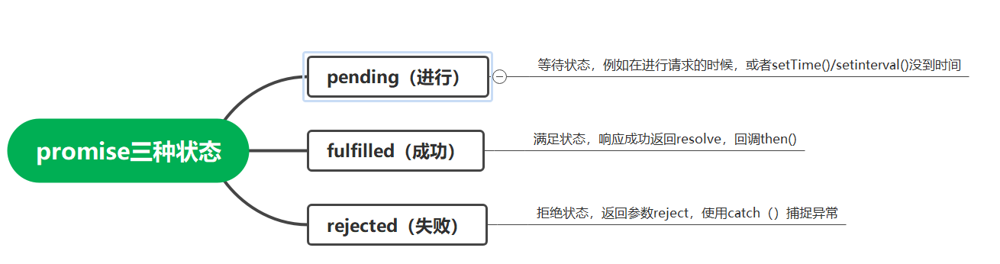

## 同步和异步

## promise

```text
promise是一种用来异步方式处理值（或非值）的方法，本身不是异步的，而是用来封装一个异步的任务。
promise是对象，代表一个函数最终可能的返回zhi-或者抛出的异常
promise作为一个异步操作的结果。
promise让异步函数看上去像同步的。
使用promise的目的是：获得功能组合和错误冒泡能力的同时，保持代码异步运行的能力。

```
resolve被调用时，带有一个履历值。
reject被调用时要带一个拒绝原因。

## async和await
await必须写在async函数中，且函数返回的是一个promise，只能依靠try/catch捕捉异常。
使用await相当于把await后面的代码放在promise的then中处理。