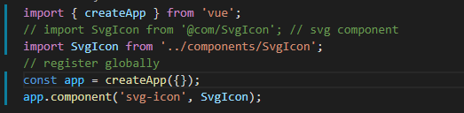

项目中常用图标方法。
（1）图像精灵：image sprite
（2）字体图标iconfont 是可以使用css修改的文本文件
使用：前端通过定义@font-face引入字体，最终以伪元素的方式插入页面
（3）svg图标：是一种可缩放矢量图标，基于可扩展标记语言，用于描述二维矢量图形的图形格式
使用：作为background背景图直接引用SVG文件（不推荐）
（这种外链方式往往无法修改其样式，且会造成额外HTTP请求）
作为inline svg使用，svg本身是一个html标签，可直接把SVG代码写入HTML中。

require.context()自动导入所有的.svg

